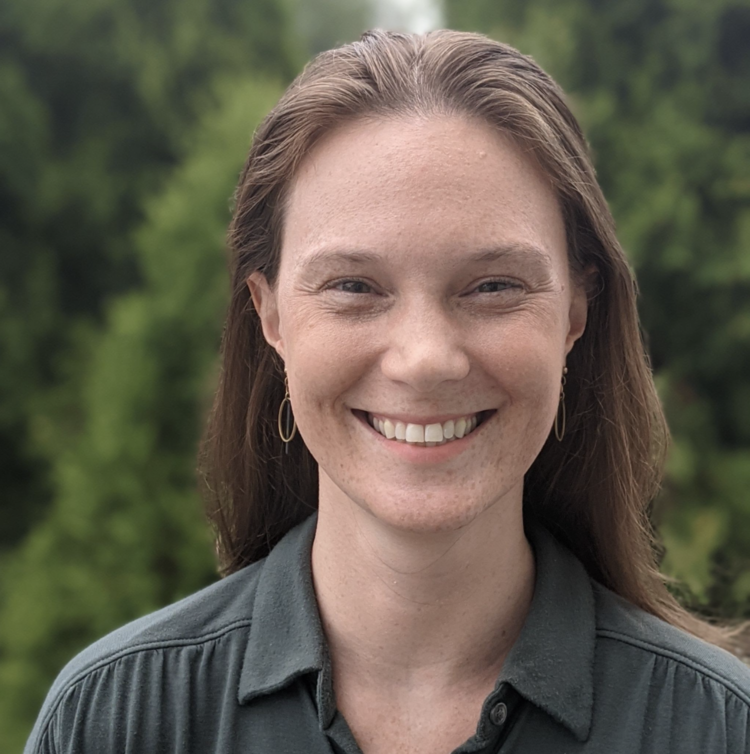
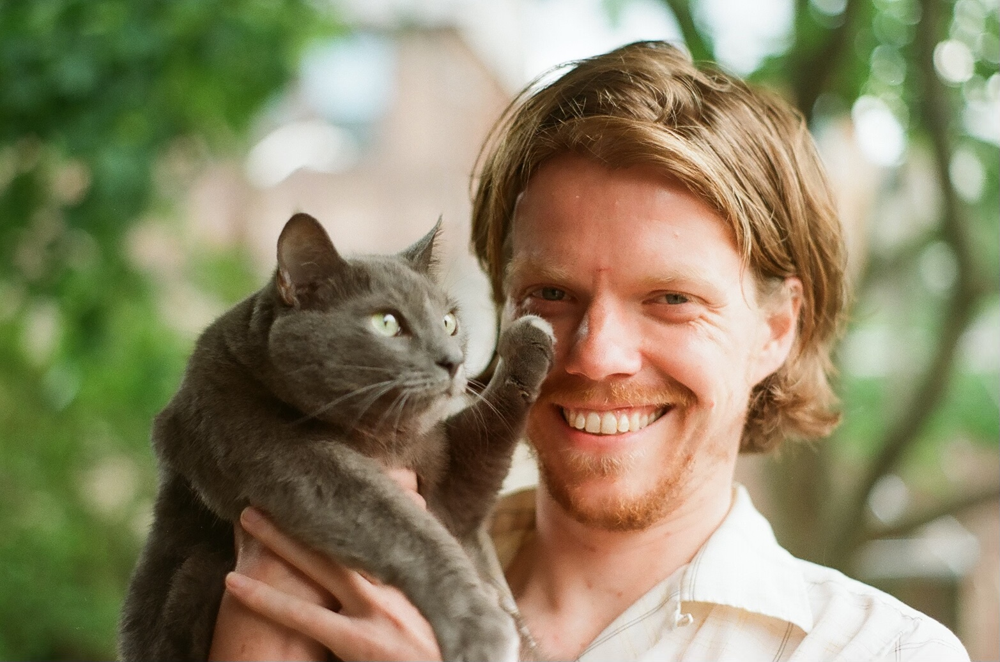

# Our Team

Psych-DS is an open-source project funded by the NIH [BRAIN Initiative](https://braininitiative.nih.gov/). It is developed and maintained by a small team within the MIT [Early Childhood Cognition Lab](https://eccl.mit.edu/) and is closely associated with the [Children Helping Science](https://childrenhelpingscience.com/) platform.

---

## Melissa Kline-Struhl
#### *_Executive Director, Psych-DS and Children Helping Science_*

Melissa is passionate about data management and robust science methods, and has been working with the open science community on Psych-DS on and off since 2018. She previously earned a PhD from MIT Brain & Cognitive Sciences and worked at the Center for Open Science; she is now the Executive Director of Children Helping Science, a platform for data collection with babies and children. In her spare time she likes hanging out with her daughter Talia and playing co-op boardgames.

!!! tip "Contact"
    [*_mekline@mit.edu_*](mailto:mekline@mit.edu)

---

## Brian Leonard
#### *_Software Developer, Psych-DS_*

Brian develops open-source tools to help the Psych-DS community. His background as a scientist is in Linguistics, and he has been providing technical support to researchers for going on a decade now. He lives in Baltimore with his gray cat Benjals, and in his free time he likes to write poetry, make strangers laugh, and play pool.

!!! tip "Contact"
    [*_bleonard@mit.edu_*](mailto:bleonard@mit.edu)

---

## Psych-DS Contributors

The Psych-DS specification has been developed by an open source community, including participants in hackathons at meetings of the Society for the Improvement of Psychological Sciences.

!!! abstract "Contributors"

    - Tal Yarkoni
    - Lisa DeBruine
    - Alicia Hoeflich Mohr
    - Erin M. Buchanan
    - Ruben Arslan
    - Stephen R. Martin
    - Chris Gorgolewski
    - Andreas M. Brandmaier 
    - Balazs Aczel
    - Mathew Ling 
    - Peder Isager
    - Anne Scheel 
    - Lorne Campbell
    - Patrick S. Forscher
    - Hannah Moshontz
    - Kaitlyn Werner
    - Joshua R. de Leeuw
    - Russ Poldrack
    - Kirstie Whitaker
    - Rickard Carlsson
    - Felix Henninger
    - Oliver Lindemann
    - Wolf Vanpaemel
    - Felix Schönbrodt 
    - Ian Hussey 
    - Eoghan Ó Carragáin 
    - Brett Buttliere 
    - Thomas Pronk
    - Rémi Gau
    - Matt Jaquiery
    - Adam Kimbler
    - Robert Oostenveld
    - Cyril Pernet 
    - Guiomar Niso
    - Samuel Guay
    - Gustav Nilsonne 
    - Eduard Klapwijk

---

## SIPS 2022 Hackathon attendees

!!! abstract "Attendees"
    - Ian Hussey 
    - Eva Rubínová 
    - Janna Wennberg 
    - Jack Friedrich
    - Julia Strand 
    - Katrina Sewell 
    - Tamas Nagy 
    - Mahmoud Elsherif
    - Beth Clarke
    - Alina Kuimova
    - Eric Jorgenson
    - Julia Bottesini
    - Julia Sunderland-Baker
    - Brittany Hall
    - Nin Dougall
    - Eric Tu
    - Alex Uzdavines
    - Cole J. Kennedy
